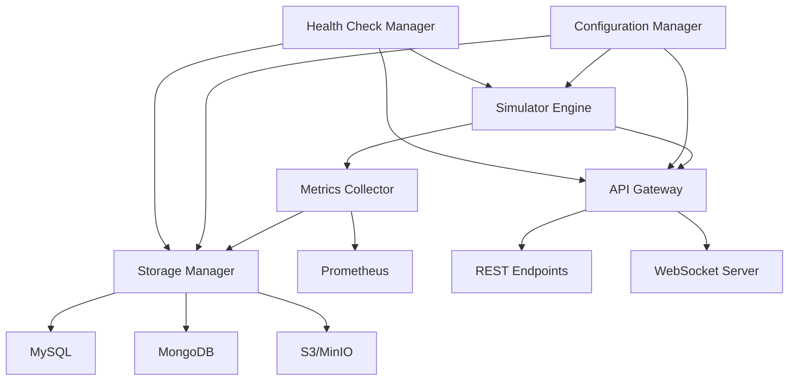
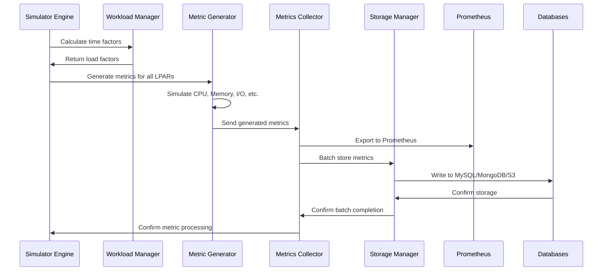
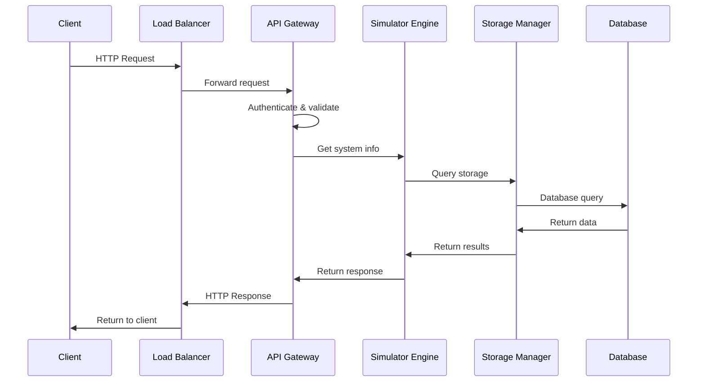
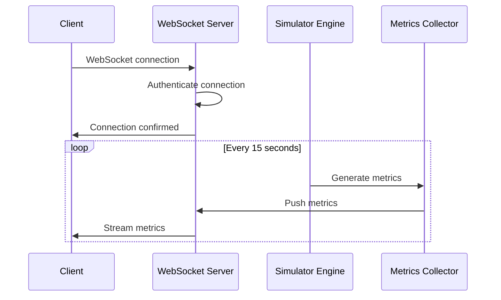
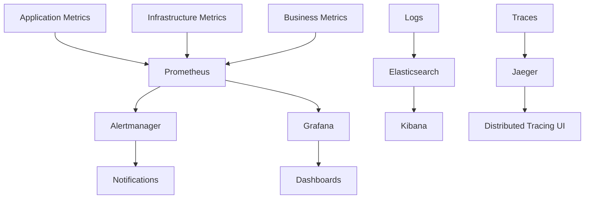
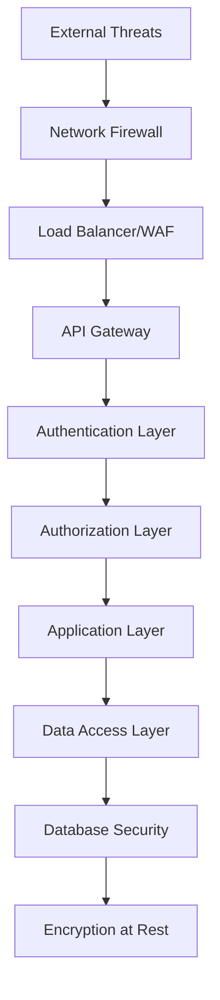

# Architecture Documentation

This document provides a comprehensive overview of the RMF Monitor III Data Simulator architecture, including system design, component interactions, data flow, and scalability considerations.

## 📋 Table of Contents

1. [System Overview](#system-overview)
2. [Component Architecture](#component-architecture)
3. [Data Flow](#data-flow)
4. [Storage Architecture](#storage-architecture)
5. [Monitoring and Observability](#monitoring-and-observability)
6. [Scalability and Performance](#scalability-and-performance)
7. [Security Architecture](#security-architecture)
8. [Deployment Architecture](#deployment-architecture)

---

## 🏗️ System Overview

The RMF Monitor III Data Simulator is a distributed system designed to generate realistic mainframe performance metrics that closely mimic IBM z/OS RMF (Resource Measurement Facility) data patterns.

### High-Level Architecture

```
┌─────────────────────────────────────────────────────────────────────────────────────┐
│                                 Client Layer                                         │
├─────────────────────────────────────────────────────────────────────────────────────┤
│  Web UI (Grafana)  │  API Clients  │  Prometheus  │  External Tools  │  Dashboards  │
└─────────────────────────────────────────────────────────────────────────────────────┘
                                          │
                                          ▼
┌─────────────────────────────────────────────────────────────────────────────────────┐
│                                 API Gateway Layer                                   │
├─────────────────────────────────────────────────────────────────────────────────────┤
│           Load Balancer (nginx/HAProxy)  │  TLS Termination  │  Rate Limiting      │
└─────────────────────────────────────────────────────────────────────────────────────┘
                                          │
                                          ▼
┌─────────────────────────────────────────────────────────────────────────────────────┐
│                              Application Layer                                      │
├─────────────────────────────────────────────────────────────────────────────────────┤
│                            FastAPI Application                                      │
│  ┌─────────────┐  ┌─────────────┐  ┌─────────────┐  ┌─────────────┐  ┌─────────────┐ │
│  │  Simulator  │  │  Metrics    │  │  API        │  │  Health     │  │  Config     │ │
│  │  Engine     │  │  Collector  │  │  Endpoints  │  │  Checks     │  │  Manager    │ │
│  └─────────────┘  └─────────────┘  └─────────────┘  └─────────────┘  └─────────────┘ │
└─────────────────────────────────────────────────────────────────────────────────────┘
                                          │
                                          ▼
┌─────────────────────────────────────────────────────────────────────────────────────┐
│                              Business Logic Layer                                   │
├─────────────────────────────────────────────────────────────────────────────────────┤
│  ┌─────────────┐  ┌─────────────┐  ┌─────────────┐  ┌─────────────┐  ┌─────────────┐ │
│  │   CPU       │  │   Memory    │  │    LDEV     │  │    CLPR     │  │    MPB      │ │
│  │ Simulator   │  │ Simulator   │  │ Simulator   │  │ Simulator   │  │ Simulator   │ │
│  └─────────────┘  └─────────────┘  └─────────────┘  └─────────────┘  └─────────────┘ │
│  ┌─────────────┐  ┌─────────────┐  ┌─────────────┐  ┌─────────────┐  ┌─────────────┐ │
│  │   Ports     │  │  Volumes    │  │  Workload   │  │   Pattern   │  │   Trend     │ │
│  │ Simulator   │  │ Simulator   │  │  Manager    │  │  Generator  │  │  Analyzer   │ │
│  └─────────────┘  └─────────────┘  └─────────────┘  └─────────────┘  └─────────────┘ │
└─────────────────────────────────────────────────────────────────────────────────────┘
                                          │
                                          ▼
┌─────────────────────────────────────────────────────────────────────────────────────┐
│                               Storage Layer                                         │
├─────────────────────────────────────────────────────────────────────────────────────┤
│  ┌─────────────┐  ┌─────────────┐  ┌─────────────┐  ┌─────────────┐  ┌─────────────┐ │
│  │   MySQL     │  │  MongoDB    │  │  S3/MinIO   │  │ Prometheus  │  │   Redis     │ │
│  │(Relational) │  │(Document)   │  │(Object)     │  │(Time Series)│  │(Cache)      │ │
│  └─────────────┘  └─────────────┘  └─────────────┘  └─────────────┘  └─────────────┘ │
└─────────────────────────────────────────────────────────────────────────────────────┘
                                          │
                                          ▼
┌─────────────────────────────────────────────────────────────────────────────────────┐
│                              Infrastructure Layer                                   │
├─────────────────────────────────────────────────────────────────────────────────────┤
│  ┌─────────────┐  ┌─────────────┐  ┌─────────────┐  ┌─────────────┐  ┌─────────────┐ │
│  │ Kubernetes  │  │   Docker    │  │   Networking│  │   Storage   │  │  Monitoring │ │
│  │  Cluster    │  │ Containers  │  │    (CNI)    │  │    (CSI)    │  │   Stack     │ │
│  └─────────────┘  └─────────────┘  └─────────────┘  └─────────────┘  └─────────────┘ │
└─────────────────────────────────────────────────────────────────────────────────────┘
```

### Key Design Principles

1. **Microservices Architecture**: Loosely coupled, independently deployable services
2. **Event-Driven Design**: Asynchronous processing with event streams
3. **Polyglot Persistence**: Multiple storage technologies for different data types
4. **Horizontal Scalability**: Scale-out architecture supporting dynamic scaling
5. **Fault Tolerance**: Resilient design with graceful degradation
6. **Observability**: Comprehensive logging, metrics, and tracing

---

## 🧩 Component Architecture

### Core Components

#### 1. Simulator Engine

The heart of the system responsible for generating realistic mainframe metrics.

```python
class MainframeSimulator:
    """
    Core simulator engine that orchestrates metric generation
    across all mainframe components.
    """
    
    Components:
    - WorkloadPatternManager: Manages time-based workload patterns
    - MetricGenerationEngine: Coordinates metric simulation
    - ResourceUtilizationCalculator: Computes resource usage
    - PerformanceModelingEngine: Applies realistic performance models
    
    Responsibilities:
    - Generate authentic z/OS metrics
    - Maintain metric relationships and dependencies
    - Handle peak hours and workload cycles
    - Simulate realistic performance variations
```

#### 2. Metrics Collection System

```python
class MetricsCollector:
    """
    Collects and processes generated metrics for storage and export.
    """
    
    Components:
    - PrometheusExporter: Exports metrics in Prometheus format
    - BatchProcessor: Batches metrics for efficient storage
    - MetricValidator: Validates metric integrity
    - DataEnrichment: Adds metadata and context
    
    Responsibilities:
    - Export metrics to Prometheus
    - Batch process metrics for storage
    - Validate metric correctness
    - Enrich metrics with contextual data
```

#### 3. Storage Manager

```python
class StorageManager:
    """
    Manages multi-backend storage operations.
    """
    
    Components:
    - MySQLStorageBackend: Relational data storage
    - MongoDBStorageBackend: Document-based storage
    - S3StorageBackend: Object storage for archival
    - CacheManager: Redis-based caching layer
    
    Responsibilities:
    - Coordinate writes across storage backends
    - Handle storage failures gracefully
    - Implement data lifecycle policies
    - Provide unified storage interface
```

#### 4. API Gateway

```python
class APIGateway:
    """
    FastAPI-based API gateway for external interfaces.
    """
    
    Components:
    - RESTEndpoints: HTTP REST API endpoints
    - WebSocketServer: Real-time metric streaming
    - AuthenticationMiddleware: API authentication
    - RateLimitingMiddleware: Request rate limiting
    
    Responsibilities:
    - Expose REST APIs
    - Handle WebSocket connections
    - Authenticate requests
    - Rate limit and throttle requests
```

### Component Interactions



---

## 🔄 Data Flow

### Metric Generation Flow



### Request/Response Flow



### Real-time Streaming Flow



---

## 🗄️ Storage Architecture

### Multi-Backend Storage Strategy

The simulator uses a polyglot persistence approach with different storage backends optimized for specific use cases:

#### 1. MySQL (Relational Storage)

**Use Case**: Structured data with strong consistency requirements

```sql
-- Optimized table structure
CREATE TABLE cpu_metrics (
    id BIGINT AUTO_INCREMENT PRIMARY KEY,
    timestamp DATETIME(3) NOT NULL,
    sysplex VARCHAR(50) NOT NULL,
    lpar VARCHAR(50) NOT NULL,
    cpu_type VARCHAR(50) NOT NULL,
    utilization_percent DECIMAL(5,2) NOT NULL,
    
    -- Optimized indexes
    INDEX idx_timestamp (timestamp),
    INDEX idx_lpar_cpu (lpar, cpu_type),
    INDEX idx_sysplex_timestamp (sysplex, timestamp),
    INDEX idx_composite (lpar, cpu_type, timestamp)
) ENGINE=InnoDB;
```

**Characteristics**:
- ACID compliance for data integrity
- Complex query support with JOINs
- Optimized for analytical queries
- Automatic data partitioning by date

#### 2. MongoDB (Document Storage)

**Use Case**: Flexible schema for complex metric structures

```javascript
// Document structure
{
  "_id": ObjectId("..."),
  "timestamp": ISODate("2024-01-15T10:30:00Z"),
  "sysplex": "SYSPLEX01",
  "lpar": "PROD01",
  "metrics": {
    "cpu": {
      "general_purpose": 75.5,
      "ziip": 45.3,
      "zaap": 31.8
    },
    "memory": {
      "real_storage": 51539607552,
      "virtual_storage": 274877906944,
      "csa": 419430400
    },
    "devices": [
      {
        "id": "3390_01",
        "type": "3390",
        "utilization": 42.5,
        "response_time": 0.008
      }
    ]
  }
}
```

**Characteristics**:
- Schema flexibility for evolving metric structures
- Horizontal scaling with sharding
- Efficient for nested data queries
- Built-in aggregation framework

#### 3. S3/MinIO (Object Storage)

**Use Case**: Long-term archival and data lake scenarios

```
Storage Structure:
rmf-metrics/
├── metrics/
│   ├── cpu/
│   │   └── SYSPLEX01/
│   │       └── PROD01/
│   │           └── 2024/01/15/10/
│   │               └── 20240115_103000.json.gz
│   ├── memory/
│   └── ...
├── archive/
│   └── monthly/
│       └── 2024/01/
│           └── archive_20240101_20240131.json.gz
└── exports/
    └── csv/
        └── cpu_metrics_20240115.csv
```

**Characteristics**:
- Unlimited scalability
- Cost-effective for large datasets
- Built-in versioning and lifecycle management
- Parallel processing capabilities

#### 4. Prometheus (Time Series Storage)

**Use Case**: Real-time monitoring and alerting

```prometheus
# Metric structure
rmf_cpu_utilization_percent{
  sysplex="SYSPLEX01",
  lpar="PROD01",
  cpu_type="general_purpose"
} 75.5 @1642248600000

rmf_memory_usage_bytes{
  sysplex="SYSPLEX01",
  lpar="PROD01",
  memory_type="real_storage"
} 51539607552 @1642248600000
```

**Characteristics**:
- Optimized for time-series data
- Efficient compression and storage
- Powerful query language (PromQL)
- Integration with alerting systems

### Storage Patterns

#### Write Pattern

```python
async def store_metrics(metrics_batch):
    """
    Optimized storage pattern for high-throughput writes
    """
    tasks = []
    
    # Parallel writes to all backends
    tasks.append(mysql_service.bulk_insert(metrics_batch))
    tasks.append(mongodb_service.bulk_insert(metrics_batch))
    tasks.append(s3_service.batch_store(metrics_batch))
    
    # Wait for all writes to complete
    results = await asyncio.gather(*tasks, return_exceptions=True)
    
    # Handle partial failures
    for i, result in enumerate(results):
        if isinstance(result, Exception):
            logger.error(f"Storage backend {i} failed: {result}")
            # Implement retry logic or fallback
```

#### Read Pattern

```python
async def get_metrics(query_params):
    """
    Optimized read pattern with caching and fallback
    """
    # Check cache first
    cached_result = await cache.get(query_key)
    if cached_result:
        return cached_result
    
    # Query most appropriate backend
    if query_params.requires_aggregation:
        result = await mongodb_service.aggregate(query_params)
    elif query_params.requires_joins:
        result = await mysql_service.query(query_params)
    else:
        result = await s3_service.retrieve(query_params)
    
    # Cache result
    await cache.set(query_key, result, ttl=300)
    return result
```

---

## 📊 Monitoring and Observability

### Metrics Architecture



#### Application Metrics

```python
# Custom metrics for the simulator
from prometheus_client import Counter, Gauge, Histogram

# Business metrics
METRICS_GENERATED = Counter('rmf_metrics_generated_total', 'Total metrics generated', ['metric_type'])
SIMULATION_DURATION = Histogram('rmf_simulation_duration_seconds', 'Time spent generating metrics')
ACTIVE_LPARS = Gauge('rmf_active_lpars', 'Number of active LPARs')

# Technical metrics
DATABASE_CONNECTIONS = Gauge('rmf_database_connections', 'Database connections', ['backend'])
STORAGE_OPERATIONS = Counter('rmf_storage_operations_total', 'Storage operations', ['backend', 'operation'])
API_REQUESTS = Counter('rmf_api_requests_total', 'API requests', ['endpoint', 'method', 'status'])
```

#### Infrastructure Metrics

```yaml
# Kubernetes metrics
- container_cpu_usage_seconds_total
- container_memory_usage_bytes
- container_network_receive_bytes_total
- container_network_transmit_bytes_total
- kube_pod_container_restarts_total
- kube_deployment_status_replicas_available

# Database metrics
- mysql_global_status_connections
- mysql_global_status_slow_queries
- mongodb_connections_current
- mongodb_op_counters_total
```

### Logging Architecture

```python
# Structured logging configuration
import structlog
import logging

# Configure structured logging
structlog.configure(
    processors=[
        structlog.stdlib.filter_by_level,
        structlog.stdlib.add_logger_name,
        structlog.stdlib.add_log_level,
        structlog.stdlib.PositionalArgumentsFormatter(),
        structlog.processors.TimeStamper(fmt="iso"),
        structlog.processors.StackInfoRenderer(),
        structlog.processors.format_exc_info,
        structlog.processors.UnicodeDecoder(),
        structlog.processors.JSONRenderer()
    ],
    context_class=dict,
    logger_factory=structlog.stdlib.LoggerFactory(),
    wrapper_class=structlog.stdlib.BoundLogger,
    cache_logger_on_first_use=True,
)

# Example usage
logger = structlog.get_logger()
logger.info("Metrics generated", 
           lpar="PROD01", 
           metric_type="cpu", 
           count=100,
           duration=0.5)
```

### Distributed Tracing

```python
# OpenTelemetry tracing
from opentelemetry import trace
from opentelemetry.exporter.jaeger.thrift import JaegerExporter
from opentelemetry.sdk.trace import TracerProvider
from opentelemetry.sdk.trace.export import BatchSpanProcessor

# Configure tracing
trace.set_tracer_provider(TracerProvider())
tracer = trace.get_tracer(__name__)

jaeger_exporter = JaegerExporter(
    agent_host_name="jaeger",
    agent_port=6831,
)

span_processor = BatchSpanProcessor(jaeger_exporter)
trace.get_tracer_provider().add_span_processor(span_processor)

# Example tracing
@tracer.start_as_current_span("generate_metrics")
def generate_metrics(lpar_config):
    with tracer.start_as_current_span("cpu_simulation") as span:
        span.set_attribute("lpar.name", lpar_config.name)
        span.set_attribute("lpar.workload_type", lpar_config.workload_type)
        # Simulation logic here
```

---

## ⚡ Scalability and Performance

### Horizontal Scaling Strategy

#### Application Scaling

```yaml
# Kubernetes HPA configuration
apiVersion: autoscaling/v2
kind: HorizontalPodAutoscaler
metadata:
  name: rmf-simulator-hpa
spec:
  scaleTargetRef:
    apiVersion: apps/v1
    kind: Deployment
    name: rmf-simulator
  minReplicas: 2
  maxReplicas: 20
  metrics:
  - type: Resource
    resource:
      name: cpu
      target:
        type: Utilization
        averageUtilization: 70
  - type: Resource
    resource:
      name: memory
      target:
        type: Utilization
        averageUtilization: 80
  - type: Pods
    pods:
      metric:
        name: rmf_metrics_generated_per_second
      target:
        type: AverageValue
        averageValue: "1000"
```

#### Database Scaling

```yaml
# MySQL read replicas
apiVersion: apps/v1
kind: Deployment
metadata:
  name: mysql-read-replica
spec:
  replicas: 3
  selector:
    matchLabels:
      app: mysql-read-replica
  template:
    spec:
      containers:
      - name: mysql
        image: mysql:8.0
        env:
        - name: MYSQL_REPLICATION_MODE
          value: "slave"
        - name: MYSQL_MASTER_HOST
          value: "mysql-master"
        - name: MYSQL_MASTER_USER
          value: "replication"
        - name: MYSQL_MASTER_PASSWORD
          value: "replication-password"
```

#### Storage Scaling

```python
# Sharding strategy for MongoDB
class MongoShardingStrategy:
    def __init__(self):
        self.shard_key = "lpar"
        self.shard_count = 8
    
    def get_shard_key(self, lpar_name):
        return hash(lpar_name) % self.shard_count
    
    def get_connection(self, lpar_name):
        shard_id = self.get_shard_key(lpar_name)
        return self.connections[shard_id]
```

### Performance Optimization

#### CPU Optimization

```python
# Async processing for I/O operations
import asyncio
import aiohttp

class OptimizedSimulator:
    def __init__(self):
        self.semaphore = asyncio.Semaphore(100)  # Limit concurrent operations
    
    async def process_metrics_batch(self, metrics_batch):
        async with self.semaphore:
            tasks = []
            for metric in metrics_batch:
                tasks.append(self.process_single_metric(metric))
            
            results = await asyncio.gather(*tasks)
            return results
    
    async def process_single_metric(self, metric):
        # CPU-intensive operations
        return await asyncio.get_event_loop().run_in_executor(
            None, self.cpu_intensive_calculation, metric
        )
```

#### Memory Optimization

```python
# Memory-efficient data structures
import sys
from dataclasses import dataclass
from typing import NamedTuple

# Use slots for memory efficiency
@dataclass
class MetricData:
    __slots__ = ['timestamp', 'lpar', 'value', 'metric_type']
    timestamp: float
    lpar: str
    value: float
    metric_type: str

# Use generators for large datasets
def generate_metrics_stream(lpar_configs):
    for lpar_config in lpar_configs:
        for metric_type in ['cpu', 'memory', 'io']:
            yield generate_metric(lpar_config, metric_type)

# Memory pooling for frequent allocations
class MetricPool:
    def __init__(self, size=1000):
        self.pool = [MetricData(0, '', 0.0, '') for _ in range(size)]
        self.index = 0
    
    def get_metric(self):
        if self.index >= len(self.pool):
            self.index = 0
        metric = self.pool[self.index]
        self.index += 1
        return metric
```

#### I/O Optimization

```python
# Batch processing for database operations
class BatchProcessor:
    def __init__(self, batch_size=1000, flush_interval=30):
        self.batch_size = batch_size
        self.flush_interval = flush_interval
        self.buffer = []
        self.last_flush = time.time()
    
    async def add_metric(self, metric):
        self.buffer.append(metric)
        
        if (len(self.buffer) >= self.batch_size or 
            time.time() - self.last_flush >= self.flush_interval):
            await self.flush()
    
    async def flush(self):
        if not self.buffer:
            return
        
        batch = self.buffer.copy()
        self.buffer.clear()
        self.last_flush = time.time()
        
        # Parallel writes to all storage backends
        await asyncio.gather(
            self.write_to_mysql(batch),
            self.write_to_mongodb(batch),
            self.write_to_s3(batch)
        )
```

### Caching Strategy

```python
# Multi-level caching architecture
import redis
import pickle
from functools import wraps

class CacheManager:
    def __init__(self):
        self.redis_client = redis.Redis(host='redis', port=6379, db=0)
        self.local_cache = {}
        self.local_cache_size = 1000
    
    def cache_key(self, func_name, *args, **kwargs):
        key_parts = [func_name] + list(map(str, args))
        key_parts.extend(f"{k}:{v}" for k, v in sorted(kwargs.items()))
        return ":".join(key_parts)
    
    def cached(self, ttl=300):
        def decorator(func):
            @wraps(func)
            async def wrapper(*args, **kwargs):
                cache_key = self.cache_key(func.__name__, *args, **kwargs)
                
                # Check local cache first
                if cache_key in self.local_cache:
                    return self.local_cache[cache_key]
                
                # Check Redis cache
                cached_result = self.redis_client.get(cache_key)
                if cached_result:
                    result = pickle.loads(cached_result)
                    self.local_cache[cache_key] = result
                    return result
                
                # Execute function
                result = await func(*args, **kwargs)
                
                # Cache result
                self.redis_client.setex(
                    cache_key, 
                    ttl, 
                    pickle.dumps(result)
                )
                
                # Update local cache
                if len(self.local_cache) >= self.local_cache_size:
                    # Remove oldest entry
                    oldest_key = next(iter(self.local_cache))
                    del self.local_cache[oldest_key]
                
                self.local_cache[cache_key] = result
                return result
            
            return wrapper
        return decorator
```

---

## 🔒 Security Architecture

### Defense in Depth



### Security Components

#### 1. Network Security

```yaml
# Network policies
apiVersion: networking.k8s.io/v1
kind: NetworkPolicy
metadata:
  name: rmf-simulator-netpol
spec:
  podSelector:
    matchLabels:
      app: rmf-simulator
  policyTypes:
  - Ingress
  - Egress
  ingress:
  - from:
    - podSelector:
        matchLabels:
          app: prometheus
    ports:
    - protocol: TCP
      port: 8000
  egress:
  - to:
    - podSelector:
        matchLabels:
          app: mysql
    ports:
    - protocol: TCP
      port: 3306
```

#### 2. Authentication and Authorization

```python
# JWT-based authentication
import jwt
from datetime import datetime, timedelta
from fastapi import HTTPException, Depends
from fastapi.security import HTTPBearer, HTTPAuthorizationCredentials

security = HTTPBearer()

class AuthManager:
    def __init__(self, secret_key: str):
        self.secret_key = secret_key
        self.algorithm = "HS256"
    
    def create_token(self, user_data: dict, expires_delta: timedelta = None):
        to_encode = user_data.copy()
        if expires_delta:
            expire = datetime.utcnow() + expires_delta
        else:
            expire = datetime.utcnow() + timedelta(hours=24)
        
        to_encode.update({"exp": expire})
        return jwt.encode(to_encode, self.secret_key, algorithm=self.algorithm)
    
    def verify_token(self, token: str):
        try:
            payload = jwt.decode(token, self.secret_key, algorithms=[self.algorithm])
            return payload
        except jwt.ExpiredSignatureError:
            raise HTTPException(status_code=401, detail="Token expired")
        except jwt.JWTError:
            raise HTTPException(status_code=401, detail="Invalid token")

# Dependency for protected endpoints
async def get_current_user(credentials: HTTPAuthorizationCredentials = Depends(security)):
    auth_manager = AuthManager(os.getenv("JWT_SECRET_KEY"))
    return auth_manager.verify_token(credentials.credentials)
```

#### 3. Data Encryption

```python
# Encryption at rest and in transit
from cryptography.fernet import Fernet
import ssl

class EncryptionManager:
    def __init__(self, key: bytes = None):
        self.key = key or Fernet.generate_key()
        self.cipher = Fernet(self.key)
    
    def encrypt_data(self, data: str) -> bytes:
        return self.cipher.encrypt(data.encode())
    
    def decrypt_data(self, encrypted_data: bytes) -> str:
        return self.cipher.decrypt(encrypted_data).decode()
    
    @staticmethod
    def create_ssl_context():
        context = ssl.create_default_context(ssl.Purpose.SERVER_AUTH)
        context.check_hostname = False
        context.verify_mode = ssl.CERT_REQUIRED
        return context
```

#### 4. Security Monitoring

```python
# Security event monitoring
import structlog
from datetime import datetime

security_logger = structlog.get_logger("security")

class SecurityMonitor:
    def __init__(self):
        self.failed_attempts = {}
        self.max_attempts = 5
        self.lockout_duration = 300  # 5 minutes
    
    def log_security_event(self, event_type: str, user_id: str, details: dict):
        security_logger.warning(
            "Security event detected",
            event_type=event_type,
            user_id=user_id,
            timestamp=datetime.utcnow().isoformat(),
            details=details
        )
    
    def check_rate_limit(self, user_id: str) -> bool:
        current_time = datetime.utcnow()
        
        if user_id not in self.failed_attempts:
            return True
        
        attempts = self.failed_attempts[user_id]
        if len(attempts) >= self.max_attempts:
            last_attempt = attempts[-1]
            if (current_time - last_attempt).seconds < self.lockout_duration:
                return False
            else:
                # Reset after lockout period
                self.failed_attempts[user_id] = []
        
        return True
    
    def record_failed_attempt(self, user_id: str):
        current_time = datetime.utcnow()
        if user_id not in self.failed_attempts:
            self.failed_attempts[user_id] = []
        
        self.failed_attempts[user_id].append(current_time)
        
        # Keep only recent attempts
        cutoff_time = current_time - timedelta(seconds=self.lockout_duration)
        self.failed_attempts[user_id] = [
            attempt for attempt in self.failed_attempts[user_id]
            if attempt > cutoff_time
        ]
```

---

## 🚀 Deployment Architecture

### Container Architecture

```dockerfile
# Multi-stage build for optimized container
FROM python:3.11-slim as builder

# Install build dependencies
RUN apt-get update && apt-get install -y \
    gcc \
    g++ \
    && rm -rf /var/lib/apt/lists/*

# Install Python dependencies
COPY requirements.txt .
RUN pip install --no-cache-dir -r requirements.txt

# Production stage
FROM python:3.11-slim as production

# Create non-root user
RUN groupadd -r appuser && useradd -r -g appuser appuser

# Copy application
COPY --from=builder /usr/local/lib/python3.11/site-packages /usr/local/lib/python3.11/site-packages
COPY --from=builder /usr/local/bin /usr/local/bin
COPY --chown=appuser:appuser . /app

# Set working directory
WORKDIR /app

# Switch to non-root user
USER appuser

# Health check
HEALTHCHECK --interval=30s --timeout=10s --start-period=5s --retries=3 \
    CMD curl -f http://localhost:8000/health || exit 1

# Run application
CMD ["uvicorn", "app.main:app", "--host", "0.0.0.0", "--port", "8000"]
```

### Kubernetes Deployment

```yaml
# Complete Kubernetes deployment
apiVersion: apps/v1
kind: Deployment
metadata:
  name: rmf-simulator
  namespace: rmf-monitoring
  labels:
    app: rmf-simulator
    version: v1.0.0
spec:
  replicas: 3
  strategy:
    type: RollingUpdate
    rollingUpdate:
      maxSurge: 1
      maxUnavailable: 0
  selector:
    matchLabels:
      app: rmf-simulator
  template:
    metadata:
      labels:
        app: rmf-simulator
        version: v1.0.0
      annotations:
        prometheus.io/scrape: "true"
        prometheus.io/port: "8000"
        prometheus.io/path: "/metrics"
    spec:
      serviceAccountName: rmf-simulator
      securityContext:
        runAsNonRoot: true
        runAsUser: 1000
        runAsGroup: 1000
        fsGroup: 1000
      containers:
      - name: rmf-simulator
        image: rmf-simulator:latest
        imagePullPolicy: IfNotPresent
        ports:
        - containerPort: 8000
          name: http
        env:
        - name: LOG_LEVEL
          value: "INFO"
        - name: PROMETHEUS_MULTIPROC_DIR
          value: "/tmp/prometheus_multiproc_dir"
        envFrom:
        - configMapRef:
            name: rmf-simulator-config
        - secretRef:
            name: rmf-simulator-secrets
        resources:
          requests:
            memory: "512Mi"
            cpu: "250m"
          limits:
            memory: "2Gi"
            cpu: "1000m"
        livenessProbe:
          httpGet:
            path: /health
            port: 8000
          initialDelaySeconds: 30
          periodSeconds: 10
          timeoutSeconds: 5
          failureThreshold: 3
        readinessProbe:
          httpGet:
            path: /ready
            port: 8000
          initialDelaySeconds: 5
          periodSeconds: 5
          timeoutSeconds: 3
          failureThreshold: 3
        startupProbe:
          httpGet:
            path: /startup
            port: 8000
          initialDelaySeconds: 10
          periodSeconds: 5
          timeoutSeconds: 3
          failureThreshold: 30
        volumeMounts:
        - name: prometheus-tmp
          mountPath: /tmp/prometheus_multiproc_dir
        - name: config-volume
          mountPath: /app/config
          readOnly: true
        securityContext:
          allowPrivilegeEscalation: false
          capabilities:
            drop:
            - ALL
          readOnlyRootFilesystem: true
      volumes:
      - name: prometheus-tmp
        emptyDir: {}
      - name: config-volume
        configMap:
          name: rmf-simulator-config
      nodeSelector:
        kubernetes.io/os: linux
      tolerations:
      - key: "node-role.kubernetes.io/spot"
        operator: "Equal"
        value: "true"
        effect: "NoSchedule"
      affinity:
        podAntiAffinity:
          preferredDuringSchedulingIgnoredDuringExecution:
          - weight: 100
            podAffinityTerm:
              labelSelector:
                matchExpressions:
                - key: app
                  operator: In
                  values:
                  - rmf-simulator
              topologyKey: kubernetes.io/hostname
```

This comprehensive architecture documentation provides a deep understanding of the system design, component interactions, and deployment strategies for the RMF Monitor III Data Simulator.